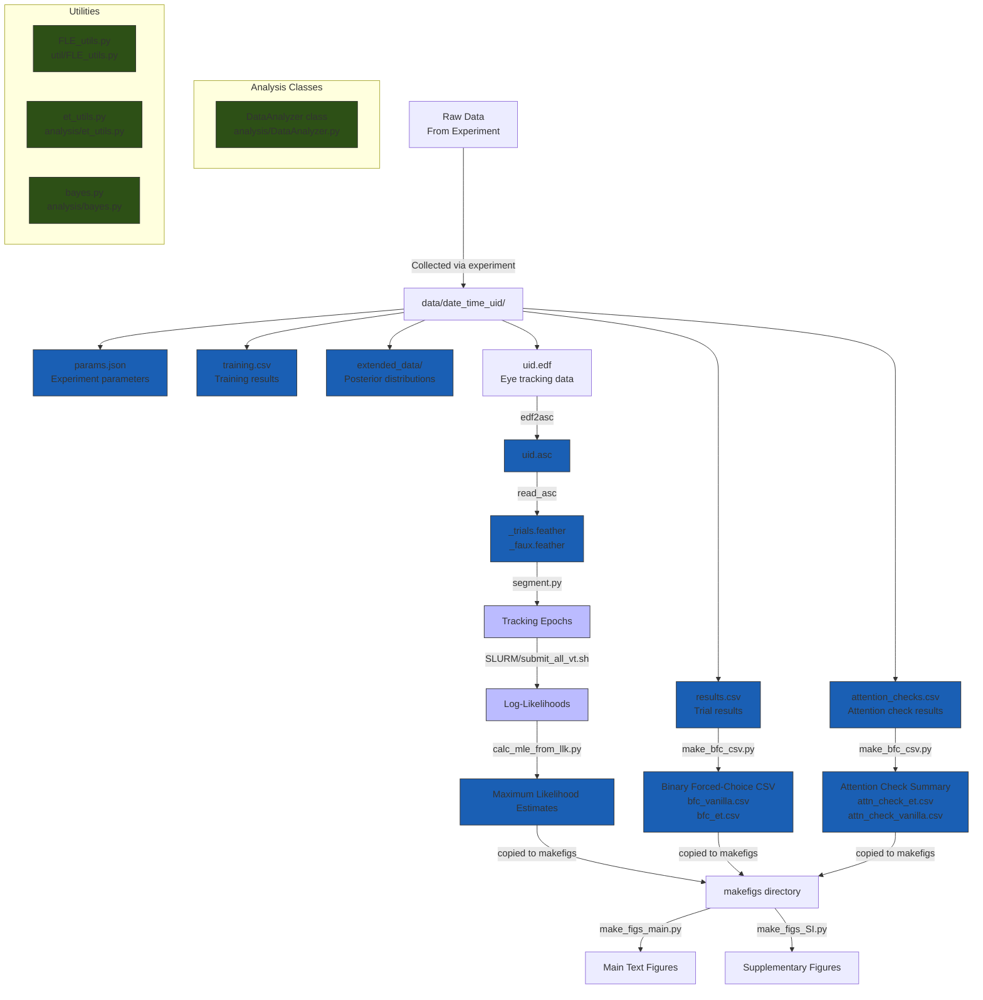

# Flash lag experiment analysis
This repository contains code for analyzing data from the flash-lag experiment.
It is being developed by Yotam Federman (@Sha-yol on GitHub).
For code used to run the experiment, see the [flash-lag-experiment](https://github.com/ComDePri/fle-experiment) repository.
It has additional information about the experiment flow.

The purpose of the experiment is to infer the parameters of the psychometric response functions of the participants,
and to compare them between different conditions. In the experiment, participants are presented with a moving shape
and a flasher, and are asked to indicate whether the flasher appeared to the left or to the right of the mover. 
This is intepreted internally as whether the flasher preceded or lagged behind the mover. The psychometric response 
function is the probability of responding "preceding" as a function of the offset between the mover and the flasher.
It is modeled as a cumulative Gaussian distribution, with a mean and a standard deviation, according to the following
formula:
$$P(\text{preceding}|\text{offset}) = \delta + (1 - \gamma - \delta) \Phi(\frac{\text{offset} - \mu}{\sigma})$$
where $\Phi$ is the cumulative Gaussian distribution function. $\delta, \gamma$ are the lower asymptote and lapse
rate of the function, respectively.

There is also an option to analyze data from an experiment with an eye-tracker (Eyelink 1000).

## Data Flow
The following diagram illustrates the data flow in this repository:

## Installation
1. Clone the repository to your local machine.
2. Install the required packages by running `pip install -r requirements.txt` in the repository's root directory.

## Usage
In order to recreate the figures in the paper, follow these steps:
1. Segment trials to tracking epochs: run `/analysis/scripts/segment.py /path/to/data`. `/path/to/data` should contain a directory called `raw` with a directory for each participant, as described in `README_DATA.md`.
2. Copy the epoch folder to a SLURM-managed cluster. Clone the repository there as well.
3. Edit the paths in `/analysis/scripts/SLURM/submit_sweep.sh` according to you directory structure.
4. Calculate log-likelihood based on the tracking epochs: run `/analysis/scripts/SLURM/submit_all_vt.sh PARTICIPANT_ID` to submit the analysis jobs for `PARTICIPANT_ID`.
5. Copy the resultant log-likelihoods folder back to your local machine.
6. (If starting from the log-likelihoods, start from the following step)
7. Calculate maximum likelihood estimators: run `/analysis/scripts/calc_mle_from_llk.py /path/to/llk`. Copy the generated file to `/makefigs` 
8. Generate CSV files of all binary forced-choice data: run `/analysis/make_bfc_csv.py /path/to/bfc/data`.
9. Do the above for experiment 1 and 2. Copy the files to `/makefigs`.
10. Run `/makefigs/main/make_figs_main.py` to generate the figures for the main text, and the accompanying figure data .xlsx file.
11. Run `/makefigs/SI/make_figs_SI.py` to generate the supplementary figures.

## Further reading
- `README_DATA.md` - read to learn about the data generated from an experiment that this repo expects.
